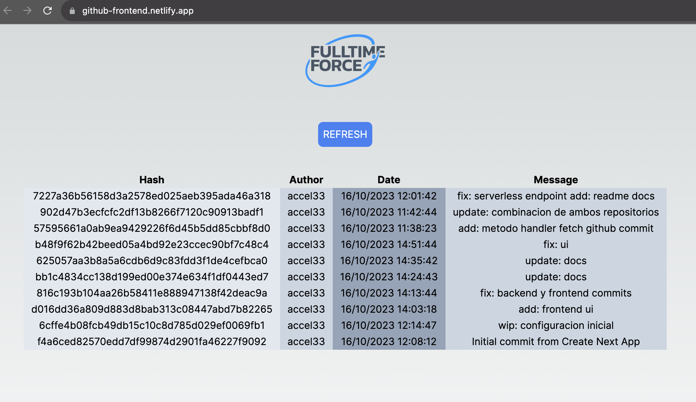

# Github Frontend App

Link de la app: https://github-frontend.netlify.app/



### Configuración inicial - Comandos a ejecutar

Clonar el repositorio para empezar a utilizar la aplicación:

```
git clone https://github.com/accel33/github-frontend
```

Proceder a entrar a la carpeta y ejecutar comando para instalar los paquetes de npm:

```
cd github-frontend && npm install
```

Hay que tener instalado [Nodejs](https://nodejs.org/en) de manera global.

Comando para ejecutar en local :

```bash
npm run dev
```

Abrir [http://localhost:3000](http://localhost:3000) con el navegador para ver el resultado.
<br>

---

### Observaciones para el entrevistador

La aplicación debería utilizar la API del servidor de ya desplegado en AWS con este link: https://grhrdrb9v0.execute-api.us-east-1.amazonaws.com/api/commits

Se ha logrado comprobar su correcto funcionamiento para obtener los commits de la API Github, pero no se ha podido correr dentro del frontend.

Se ha recurrido a obtener directamente la data de la API de Github desde el frontend. El frontend actualmente es autosostenible, no requiere de un backend. Pero lo ideal para esta prueba era lograr integrarlos. Agradecería conversar para averiguar porque no se pudo hacer fetch a la función lambda en React, cuando si se pudo en Node de manera local.


En caso se quiera observar el backend, el link para el repositorio es el siguiente: https://github.com/accel33/github-backend
